# Design Documentation

**Project:** HealthEasy — HealthEasy-G Hospital Management System
**Group:** Architects
**Course:** CSCD602 Advance Software Development, University of Ghana
**Document version:** 1.0

---

# 1. Design Principles

Four principles governed every design decision. They are stated here because the rest of
this document is best read as their consequence.

**1. The server is the only authority.**
Anything the browser sends can be forged. Identity, role and every authorisation decision are
therefore established server-side from a signed session cookie. Client-side guards exist only
to give the user a useful message.

**2. One boundary for each concern.**
Access policy is declared in exactly one file. Storage-to-presentation conversion happens in
exactly one file. Date parsing and formatting happen in exactly one file. This is deliberate:
a rule that exists in one place can be audited; a rule scattered across twenty-four route
handlers cannot.

**3. Fail closed.**
An endpoint with no declared policy is denied, not permitted. An unrecognised enum falls back
to the safest value. A write that cannot complete is reported, never silently dropped.

**4. Derive rather than store.**
Waiting time, stock status, licence expiry status and DHIMS2 attendance figures are computed
from their underlying facts at read time. A stored copy is a copy that can disagree with
reality.

---

# 2. System Architecture

## 2.1 Architectural Style

The system uses a **layered architecture within a serverless deployment model**. Next.js App
Router provides both the presentation layer (React Server and Client Components) and the
application layer (Route Handlers) in one deployable unit, with Prisma as the data-access
layer over PostgreSQL.

A layered style was chosen over microservices because the domain is a single bounded
context — one hospital's operations — with heavily interconnected data. Splitting patient,
clinical, pharmacy and billing into separate services would have introduced distributed
transactions across boundaries that must be atomic (dispensing and stock deduction; claim
batching and claim stamping), for no compensating benefit at this scale.

## 2.2 Layered View

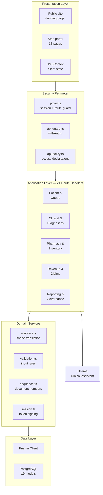

## 2.3 Responsibility of Each Layer

| Layer | Responsibility | Must not |
| :--- | :--- | :--- |
| Presentation | Render state, collect input, explain outcomes | Make authorisation decisions of record |
| Security perimeter | Establish identity; permit or deny | Contain business logic |
| Application | Orchestrate a use case end to end | Bypass the perimeter |
| Domain services | Enforce invariants that outlive any one handler | Depend on HTTP |
| Data | Persist and retrieve | Contain policy |

## 2.4 Request Lifecycle

Every request follows the same path. This is what makes the security model reviewable.

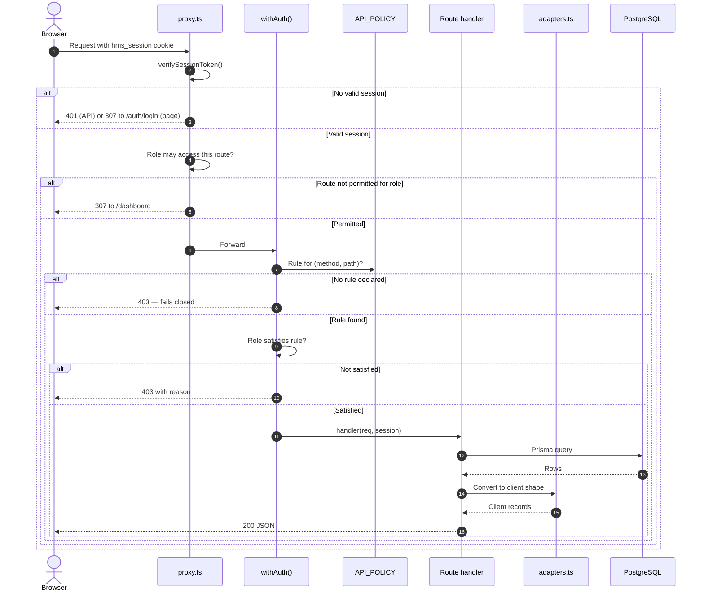

---

# 3. Technology Architecture

## 3.1 Deployment Topology

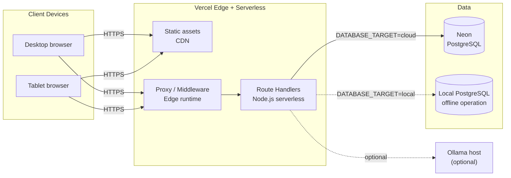

## 3.2 Technology Choices and Justification

| Concern | Choice | Justification | Alternative rejected |
| :--- | :--- | :--- | :--- |
| Framework | Next.js 16 App Router | Server and client code in one deployable; server components keep data access off the client; native middleware for a security perimeter | Separate React SPA + Express API — two deployments, duplicated types, and a perimeter that must be re-implemented |
| Language | TypeScript (strict) | Compile-time detection of shape mismatches, which is precisely the class of defect that plagued the early codebase | JavaScript — the storage/presentation mismatch would have remained invisible |
| ORM | Prisma 5 | Generated types keep the schema and code in step; parameterised queries eliminate injection; first-class migrations | Raw SQL — faster but forfeits type safety and migration tracking |
| Database | PostgreSQL | Relational integrity, transactions, native date and enum types, JSON columns for genuinely variable structures (ICD lists, order arrays) | MongoDB — clinical data is highly relational; referential integrity would move into application code |
| Session | HMAC-SHA256 signed cookie via Web Crypto | Stateless, verifiable at the edge, no session store; identical code in Edge and Node runtimes | JWT library — an unnecessary dependency for one signing scheme; server-side sessions — needs a store, defeats edge verification |
| Passwords | bcrypt, 10 rounds | Deliberate slowness; well-understood; widely reviewed | Plain SHA — unusable for passwords |
| Styling | Tailwind CSS 4 | Utility classes keep style local to markup; dark mode by variant rather than a second stylesheet | CSS modules — more files, harder theme consistency |
| Clinical AI | Ollama + rule-engine fallback | No paid API; runs offline; the fallback is deterministic and auditable | Hosted LLM API — cost, and a hard dependency on connectivity |
| Testing | Node built-in test runner + tsx | Zero additional dependencies; runs the TypeScript sources directly | Jest — heavier configuration for no gain at this size |
| Hosting | Vercel | First-class Next.js support, preview deployments, required by the coursework | Self-hosted — no benefit for an assessed project |

---

# 4. Use-Case Model

## 4.1 Use-Case Diagram — Patient Administration and Clinical Care

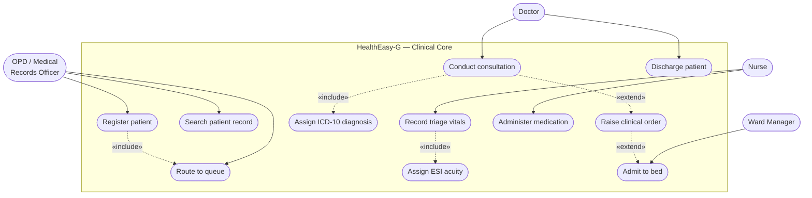

## 4.2 Use-Case Diagram — Diagnostics, Pharmacy and Revenue

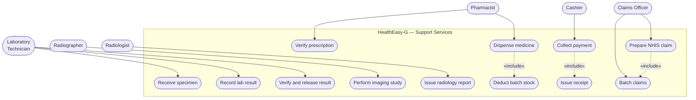

## 4.3 Use-Case Specification — Conduct Consultation

| Field | Detail |
| :--- | :--- |
| **Identifier** | UC-06 |
| **Actor** | Doctor |
| **Goal** | Record a clinical encounter and raise the orders arising from it |
| **Preconditions** | Doctor is authenticated; patient exists in the MPI; patient is in the doctor's queue |
| **Trigger** | Doctor selects a patient from the consultation queue |
| **Main flow** | 1. System presents the patient's demographics, allergies, chronic conditions, latest vitals and previous encounters.<br/>2. Doctor records presenting complaint, history, examination and plan.<br/>3. Doctor assigns one or more ICD-10 diagnoses.<br/>4. Doctor raises orders (laboratory, radiology, prescription, admission, procedure).<br/>5. Doctor signs the encounter.<br/>6. System persists the encounter attributed to the doctor's session identity.<br/>7. For each order the system creates the departmental work item and a billing line.<br/>8. For an insured patient with covered items the system prepares an NHIS claim line.<br/>9. System advances the queue entry to Completed. |
| **Alternative flows** | 4a. Doctor requests decision support: system returns prescribing suggestions restricted to stocked medicines with allergy conflicts flagged.<br/>7a. A departmental work item fails to create: the encounter is retained and the specific failure is reported to the doctor. |
| **Postconditions** | Encounter is on the patient's record; work items exist in the receiving departments; charges are raised |
| **Requirements** | FR-EMR-01 … FR-EMR-07, FR-AI-01 … FR-AI-06 |

## 4.4 Use-Case Specification — Dispense Medicine

| Field | Detail |
| :--- | :--- |
| **Identifier** | UC-07 |
| **Actor** | Pharmacist |
| **Goal** | Issue prescribed medicine and keep the stock ledger truthful |
| **Preconditions** | Pharmacist is authenticated and holds `DISPENSE_MEDICINE`; a prescription exists |
| **Main flow** | 1. Pharmacist selects the prescription.<br/>2. System presents stock in First-Expiry-First-Out order.<br/>3. Pharmacist selects a batch and quantity.<br/>4. System opens a transaction.<br/>5. System verifies the batch exists, holds sufficient quantity, and has not expired.<br/>6. System writes the dispense record attributed to the pharmacist.<br/>7. System decrements the batch conditionally on sufficient stock still being present.<br/>8. System commits.<br/>9. System writes an audit entry. |
| **Exception flows** | 5a. Batch unknown → 404, no change.<br/>5b. Insufficient stock → 409 stating quantity held and requested.<br/>5c. Batch expired → 409 stating the expiry date.<br/>7a. A concurrent dispense depleted the batch → the conditional update matches nothing, the transaction rolls back, and the pharmacist is asked to retry. |
| **Postconditions** | Either both the dispense record and the stock deduction exist, or neither does |
| **Requirements** | FR-PHM-03 … FR-PHM-06 |

---

# 5. Class Design

## 5.1 Domain Model

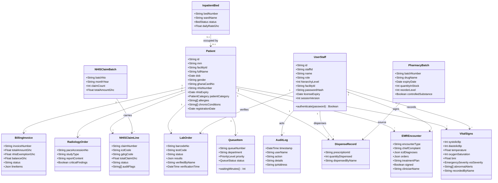

## 5.2 Security Class Design

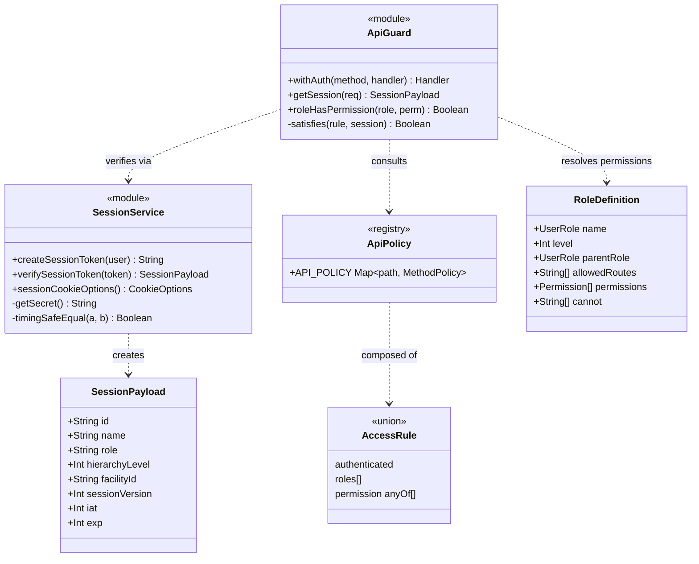

---

# 6. Sequence Diagrams

## 6.1 Staff Authentication

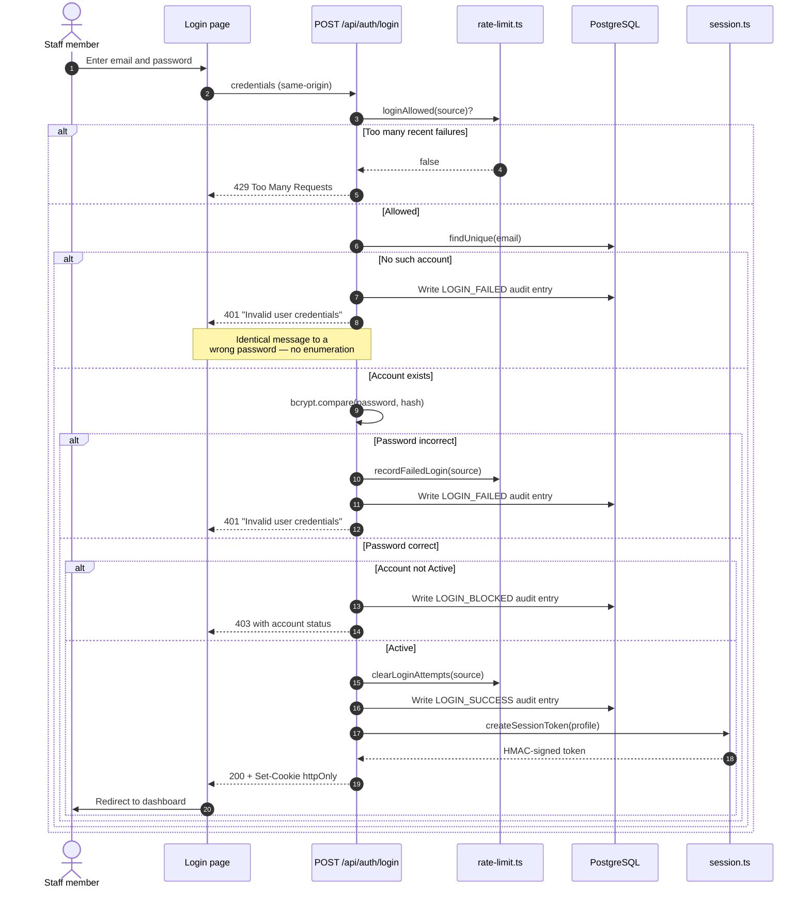

## 6.2 Consultation and Order Fan-Out

This is the sequence that makes the record "follow the patient". One clinical action produces
work items in three other departments.

```mermaid
sequenceDiagram
    autonumber
    actor D as Doctor
    participant UI as Consultation screen
    participant ENC as POST /api/encounters
    participant LAB as POST /api/lab-orders
    participant BIL as POST /api/billing
    participant CLM as POST /api/nhis-claims
    participant DB as PostgreSQL

    D->>UI: Record findings, diagnosis and orders
    UI->>ENC: Encounter with orders[]
    ENC->>ENC: Attribute clinician from session
    ENC->>DB: Create EMREncounter
    ENC->>DB: Write CREATE_ENCOUNTER audit entry
    ENC-->>UI: Saved encounter

    loop For each clinical order
        alt Laboratory order
            UI->>LAB: patient, test code
            LAB->>DB: Look up test catalogue
            LAB->>DB: Create LabOrder with barcode
            LAB-->>UI: Lab order
        end

        UI->>BIL: Line item for the order
        BIL->>BIL: Recompute totals server-side
        BIL->>DB: Create BillingInvoice
        BIL-->>UI: Invoice

        alt Patient is NHIS and item is covered
            UI->>CLM: Diagnosis and tariff
            CLM->>DB: Read patient demographics
            CLM->>CLM: Derive audit flags
            CLM->>DB: Create NHISClaimLine
            CLM-->>UI: Claim line
        end
    end

    Note over UI,D: Any failed step is reported<br/>individually; the encounter is not lost
```

## 6.3 Dispensing with Atomic Stock Deduction

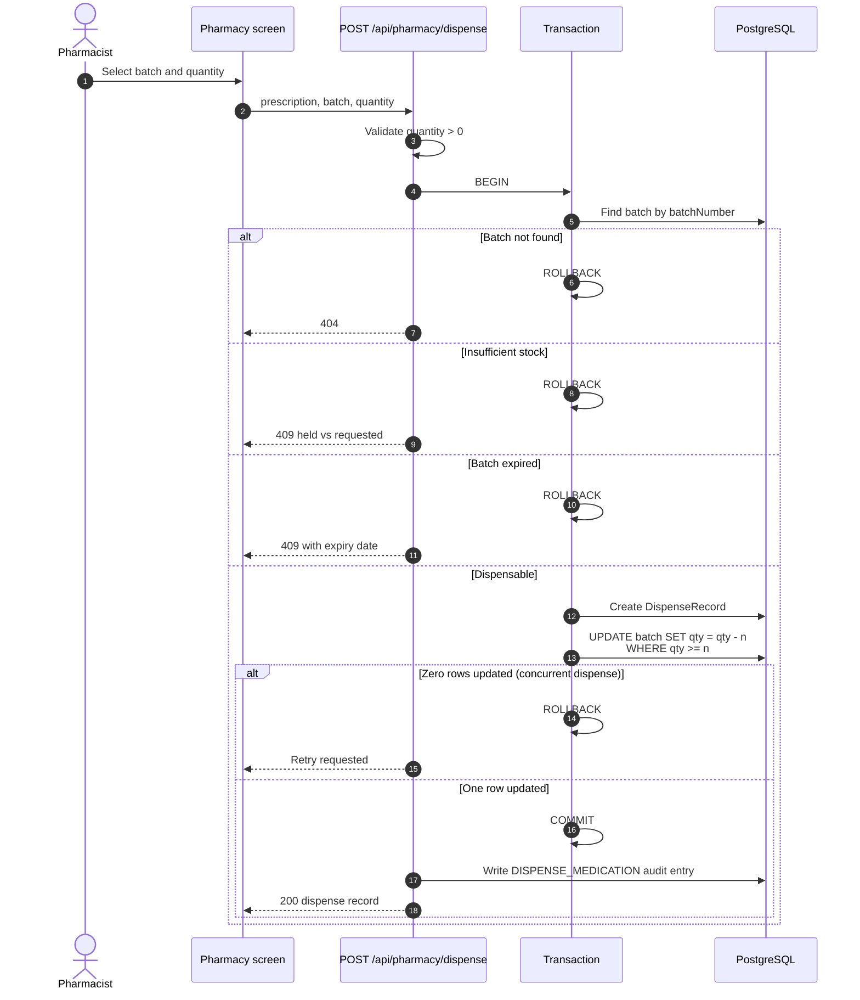

## 6.4 Access Denial — the DPC Rule in Action

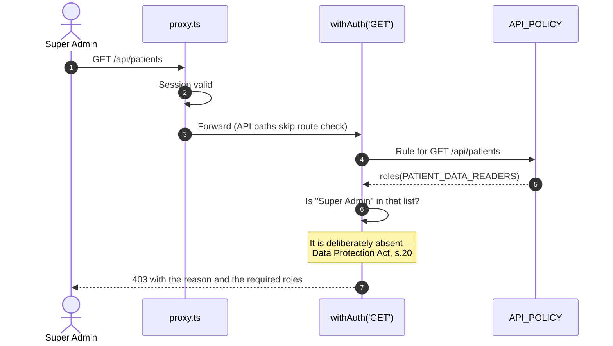

---

# 7. Activity Diagrams

## 7.1 Out-Patient Journey End to End

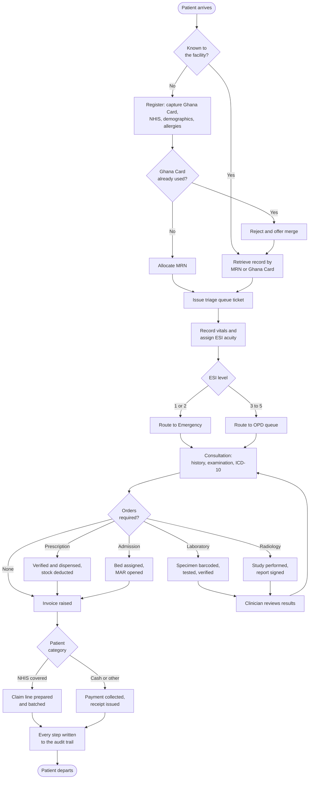

## 7.2 Laboratory Order to Verified Result

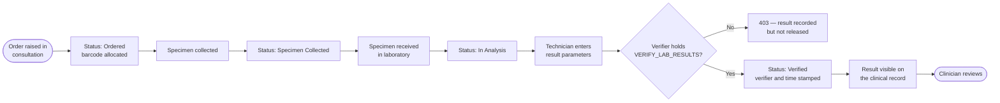

## 7.3 NHIS Claim Lifecycle

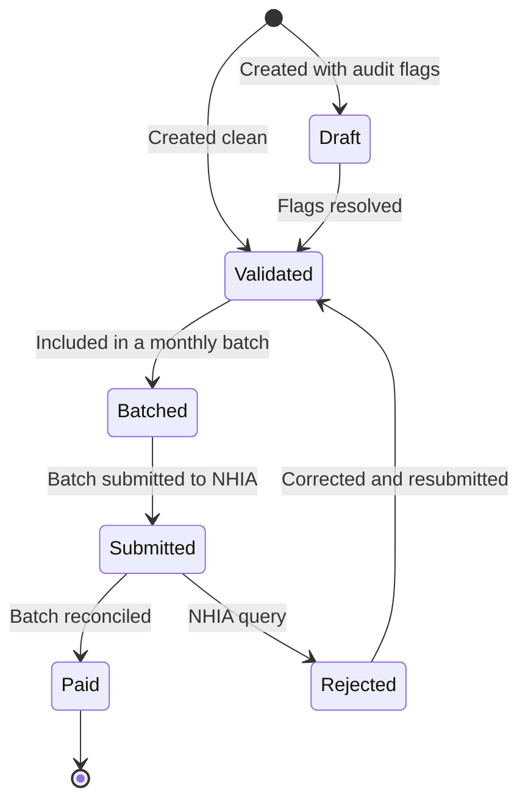

---

# 8. Data Design

## 8.1 Entity-Relationship Diagram

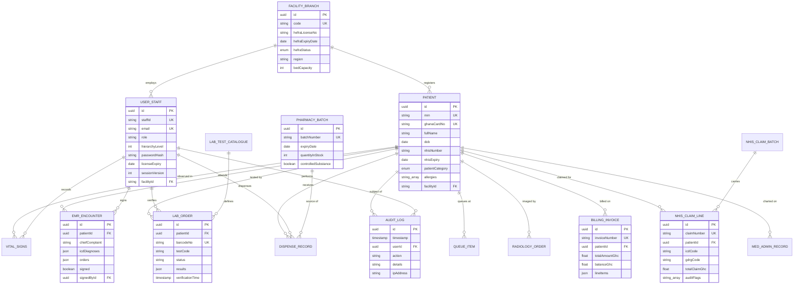

## 8.2 Database Design Decisions

**Uniqueness as the integrity mechanism.** `ghanaCardNo`, `mrn`, `staffId`, `email`,
`batchNumber`, `barcodeNo`, `invoiceNumber`, `claimNumber` and `pacsAccessionNo` all carry
unique constraints. Document numbers are allocated by generating a candidate and letting the
unique index settle collisions, with retry — because two clerks registering simultaneously
would otherwise produce the same number from a `count() + 1`.

**Native date types.** Every date is a PostgreSQL `DATE` or `TIMESTAMP`. Dates were initially
stored as text, which made every comparison lexical: `'2026-9-1'` sorts after `'2026-10-01'`,
so an expiry check or a month filter silently returned the wrong rows. Migration
`20260814000000_dates_and_session_security` converts them in place.

**Enumerations in the database.** `PatientCategory`, `QueueStatus`, `BedStatus`,
`PriorityLevel`, `EmergencySeverity`, `LicenseStatus` and `LicensingBody` are PostgreSQL
enums, so an invalid value cannot be stored at all.

**JSON where structure is genuinely variable.** `icdDiagnoses`, `orders`, `results` and
`lineItems` are JSON columns. Each is a list whose length and shape vary per record and which
is always read as a whole. Normalising them would add four tables and four joins for no query
benefit.

**Cascade on patient deletion.** Clinical children cascade from `Patient`. Audit entries do
not — the trail must outlive the record it describes.

**Derived, not stored.** Stock status, waiting minutes, licence expiry status and DHIMS2
attendance are computed at read time. A stored `status` column drifts from the quantity and
expiry it claims to describe.

## 8.3 Data Dictionary — Selected Tables

### `Patient`

| Column | Type | Constraint | Description |
| :--- | :--- | :--- | :--- |
| `id` | uuid | PK | Surrogate key |
| `mrn` | text | unique, not null | Medical Record Number, `HG-YYYY-NNNN` |
| `facilityId` | text | not null | Registering facility |
| `fullName` | text | not null | Legal name |
| `dob` | date | not null | Date of birth |
| `gender` | text | not null | Male / Female / Other |
| `ghanaCardNo` | text | unique, not null | National identity number — the duplicate-prevention key |
| `nhisNumber` | text | nullable | NHIS membership number |
| `nhisStatus` | text | nullable | Active / Expired / Pending Verification |
| `nhisExpiry` | date | nullable | Card expiry |
| `patientCategory` | enum | not null | CASH / NHIS / CORPORATE / PRIVATE_INSURANCE / EXEMPTED |
| `allergies` | text[] | not null | Known drug allergies |
| `chronicConditions` | text[] | not null | Ongoing conditions |
| `bloodGroup` | text | default `O+` | ABO/Rh group |
| `registrationDate` | date | default today | First registration |
| `consentSigned` | boolean | default true | Data-processing consent |

### `PharmacyBatch`

| Column | Type | Constraint | Description |
| :--- | :--- | :--- | :--- |
| `batchNumber` | text | unique, not null | Manufacturer batch identifier |
| `drugName` | text | not null | Generic (INN) name |
| `brandName` | text | default `''` | Trade name |
| `dosageForm` | text | default `Tablet` | Tablet, capsule, injection, etc. |
| `strength` | text | default `''` | e.g. `500mg` |
| `expiryDate` | date | not null | Drives FEFO order and dispensing refusal |
| `quantityInStock` | integer | not null | Units held |
| `reorderLevel` | integer | default 50 | Low-stock threshold |
| `controlledSubstance` | boolean | default false | Restricted handling |

### `AuditLog`

| Column | Type | Constraint | Description |
| :--- | :--- | :--- | :--- |
| `timestamp` | timestamp | default now | When |
| `userId` | uuid | FK, nullable | Actor; nullable so a failed sign-in by an unknown email can still be logged |
| `userName` | text | not null | Actor name at the time of the action |
| `role` | text | not null | Role held at the time |
| `action` | text | not null | e.g. `DISPENSE_MEDICATION` |
| `patientId` | uuid | FK, nullable | Subject, where applicable |
| `details` | text | not null | Human-readable description |
| `ipAddress` | text | default `127.0.0.1` | Source address |

---

# 9. Component Design

## 9.1 Component Diagram

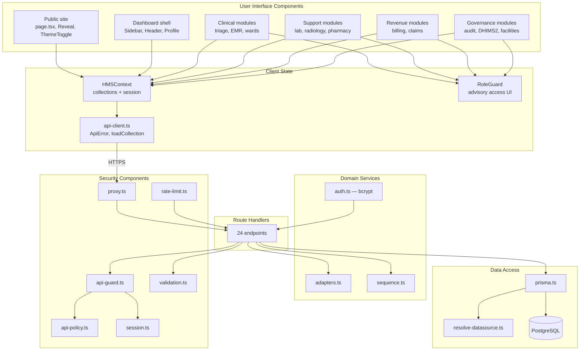

## 9.2 Component Responsibilities

| Component | Responsibility | Depends on |
| :--- | :--- | :--- |
| `proxy.ts` | Reject unauthenticated traffic; enforce role route access | `session.ts`, `rbac.ts` |
| `api-guard.ts` | Wrap handlers; apply policy; convert thrown errors to responses | `api-policy.ts`, `session.ts` |
| `api-policy.ts` | Declare who may call each endpoint and method | `rbac.ts` |
| `session.ts` | Sign and verify session tokens; cookie options | Web Crypto |
| `rate-limit.ts` | Throttle repeated failed sign-in attempts | — |
| `validation.ts` | Type, length and range checks on request input | — |
| `adapters.ts` | Convert Prisma rows to client records and back | Prisma types, `hms.ts` |
| `sequence.ts` | Allocate collision-free document numbers | Prisma error codes |
| `prisma.ts` | Provide a single client bound to the resolved datasource | `resolve-datasource.ts` |
| `resolve-datasource.ts` | Choose local or cloud PostgreSQL | Environment |
| `HMSContext` | Hold loaded collections; expose actions; surface failures | `api-client.ts` |
| `api-client.ts` | HTTP with typed errors; treat 403 as an empty collection | — |
| `RoleGuard` | Explain denied access in the interface | `HMSContext`, `rbac.ts` |

---

# 10. User-Interface Design

## 10.1 Design Language

| Aspect | Decision |
| :--- | :--- |
| Default theme | Light, with a persisted dark option |
| Public site type | Newsreader (serif display) with Manrope (sans body) — an editorial voice that distinguishes the product from generic dashboard templates |
| Portal type | Manrope throughout, optimised for dense tabular reading |
| Brand colour | Deep clinical green `#0d6b4e`; a single accent rather than a multi-hue palette |
| Status colours | Amber for waiting, green for in-progress or complete, rose for critical, stone for neutral |
| Layout | Sidebar navigation with a sticky header; content on a 12-column responsive grid |
| Density | High on worklists, low on data-entry forms |
| Motion | Scroll reveals on the public site only; suppressed under `prefers-reduced-motion` |

## 10.2 Screen Inventory

| Screen | Route | Primary roles |
| :--- | :--- | :--- |
| Public landing | `/` | Anonymous |
| Sign in | `/auth/login` | All |
| Operational dashboard | `/dashboard` | All (content varies by role) |
| Patient registration | `/patient-registration` | OPD / Medical Records |
| Patient flow and queues | `/patient-flow` | Front desk, clinical, diagnostics |
| Triage | `/triage` | Nurse, Ward Manager |
| EMR consultation | `/emr-consultation`, `/emr-consultation/[id]` | Doctor |
| Emergency | `/emergency` | Doctor, Nurse, Ward Manager |
| Wards and beds | `/wards-beds` | Ward Manager, Nurse |
| Laboratory | `/laboratory` | Laboratory Technician |
| Radiology | `/radiology` | Radiographer, Radiologist |
| Pharmacy | `/pharmacy` | Pharmacist, Store Keeper |
| Billing and cashier | `/billing-cashier` | Cashier, Finance |
| NHIS claims | `/nhis-claims` | Claims Officer, Finance |
| Inventory and procurement | `/inventory-procurement` | Store Keeper, Procurement |
| Hospitals management | `/hospitals-management` | Super Admin, Director |
| Facility configuration | `/facility-config` | Super Admin, Hospital Admin, HR |
| DHIMS2 reports | `/dhims2-reports` | Director, Records, Auditor |
| Security audit | `/security-audit` | Auditor, Super Admin |

## 10.3 Wireframe — Operational Dashboard

```
┌──────────────────────────────────────────────────────────────────────────────┐
│ ☰  HealthEasy-G          [Search…]  [Facility ▾]      [Role badge] ☾ 🔔 (av) │
├────────────────┬─────────────────────────────────────────────────────────────┤
│ OVERVIEW       │  ┌───────────────────────────────────────────────────────┐  │
│ ▸ Dashboard    │  │  Role banner — workstation title and current facility │  │
│                │  │                              [+ Primary role action]  │  │
│ PATIENT ADMIN  │  └───────────────────────────────────────────────────────┘  │
│ ▸ Registration │  ┌──────────┐ ┌──────────┐ ┌──────────┐ ┌──────────┐        │
│ ▸ Flow & Queues│  │ Waiting  │ │ Emergency│ │ Signed   │ │ Pending  │        │
│                │  │    2     │ │    0     │ │    2     │ │    2     │        │
│ CLINICAL       │  └──────────┘ └──────────┘ └──────────┘ └──────────┘        │
│ ▸ EMR          │  ┌──────┐ ┌──────┐ ┌──────┐ ┌──────┐ ┌──────┐               │
│ ▸ Emergency    │  │Start │ │Direc-│ │Queues│ │Emerg-│ │Wards │  quick actions│
│ ▸ Wards & Beds │  │consult│ │tory │ │      │ │ency  │ │      │               │
│                │  └──────┘ └──────┘ └──────┘ └──────┘ └──────┘               │
│ DIAGNOSTICS    │  ┌────────────────────────────────┐ ┌────────────────────┐  │
│ ▸ Laboratory   │  │ Active consultation queue      │ │ HeFRA status       │  │
│ ▸ Radiology    │  │ ┌────┬──────┬────┬──────┬────┐ │ │ Licence  ……………     │  │
│ ▸ Pharmacy     │  │ │Q#  │Name  │MRN │Status│Act │ │ │ Expiry   ……………     │  │
│                │  │ ├────┼──────┼────┼──────┼────┤ │ ├────────────────────┤  │
│ REVENUE        │  │ │OPD-│Kofi  │HG- │In    │[Go]│ │ │ Staff credentials  │  │
│ ▸ Billing      │  │ │001 │Ansah │0001│consult   │ │ │ • Dr K. Mensah  ✓   │  │
│ ▸ NHIS Claims  │  │ └────┴──────┴────┴──────┴────┘ │ │ • Nurse A. Osei ⚠   │  │
│                │  └────────────────────────────────┘ └────────────────────┘  │
│ [Role · Level] │                                                             │
│ [Sign out]     │                                                             │
└────────────────┴─────────────────────────────────────────────────────────────┘
```

## 10.4 Wireframe — Triage Vitals Capture

```
┌──────────────────────────────────────────────────────────────────────────────┐
│  Triage & Nursing Assessment                          Nurse Abena Osei ☾ (av)│
├──────────────────────────────────────────────────────────────────────────────┤
│  Select patient  [ Search MRN / name …                                    ▾] │
│  ┌────────────────────────────────────────────────────────────────────────┐  │
│  │ Kofi Owusu Ansah · HG-2026-0001 · M · 41y · O+                         │  │
│  │ ⚠ Allergies: Penicillin, Sulfa Drugs   Chronic: Hypertension           │  │
│  └────────────────────────────────────────────────────────────────────────┘  │
│                                                                              │
│  OBSERVATIONS                                    DERIVED                     │
│  ┌───────────────┐ ┌───────────────┐             ┌─────────────────────────┐ │
│  │ BP    ___/___ │ │ Pulse   ____  │             │ BMI        25.6         │ │
│  ├───────────────┤ ├───────────────┤             │ (computed on save)      │ │
│  │ Temp    __.__ │ │ SpO₂     ___% │             ├─────────────────────────┤ │
│  ├───────────────┤ ├───────────────┤             │ ALERTS                  │ │
│  │ Resp     ____ │ │ Glucose __.__ │             │ • Elevated BP           │ │
│  ├───────────────┤ ├───────────────┤             │ • Low SpO₂              │ │
│  │ Weight  __.__ │ │ Height  ___._ │             │ (derived on the server) │ │
│  └───────────────┘ └───────────────┘             └─────────────────────────┘ │
│                                                                              │
│  ESI ACUITY   ( )1 Resus  ( )2 Emergency  (•)3 Urgent  ( )4 Less  ( )5 Non   │
│  Pain score   [0]──────●──────[10]                                           │
│  Nursing notes ┌──────────────────────────────────────────────────────────┐  │
│                └──────────────────────────────────────────────────────────┘  │
│                                            [ Cancel ]  [ Save and route ▸ ]  │
└──────────────────────────────────────────────────────────────────────────────┘
```

## 10.5 Wireframe — Public Landing Page

```
┌──────────────────────────────────────────────────────────────────────────────┐
│ ⬢ HealthEasy-G    Why it exists  Platform  Team  Contact    ☾  [Staff sign in]│
├──────────────────────────────────────────────────────────────────────────────┤
│                                                                              │
│  ── RIDGE REGIONAL HOSPITAL, ACCRA         ┌──────────────────────────────┐  │
│                                            │ PATIENT FLOW          ● Live │  │
│  The whole hospital,                       ├──────────────────────────────┤  │
│  on one record.            (serif italic)  │ TRG-014  A. Serwaa  [IN TRIAGE] │
│                                            │ OPD-032  K. Ansah   [WITH DR]│  │
│  HealthEasy-G carries a patient from       │ LAB-009  A. Nyarko  [WAITING]│  │
│  the registration desk through triage…     ├──────────────────────────────┤  │
│                                            │ Every movement is audited    │  │
│  [ Sign in to the portal → ] [ See more ]  └──────────────────────────────┘  │
├──────────────────────────────────────────────────────────────────────────────┤
│  ALIGNED TO                                                                  │
│  HeFRA · GHS · NHIA G-DRG · DHIMS2 · DPC          (hairline rule, no cards)  │
└──────────────────────────────────────────────────────────────────────────────┘
```

## 10.6 Responsive Behaviour

| Breakpoint | Layout |
| :--- | :--- |
| < 640 px | Single column; sidebar becomes a sheet; tables scroll horizontally within their container |
| 640–1024 px | Two-column cards; sidebar collapsible |
| 1024–1280 px | Three-column cards; sidebar persistent |
| > 1280 px | Full grid with a secondary information column |

## 10.7 Accessibility

- Semantic elements (`nav`, `header`, `main`, `dl`, `table`) rather than generic containers.
- All interactive controls reachable and operable by keyboard.
- `aria-label` on icon-only controls; `aria-expanded` on disclosure controls.
- Error regions marked `role="alert"`.
- Text contrast meets WCAG AA in both themes.
- Motion suppressed under `prefers-reduced-motion`.

---

# 11. Design Rationale — Decisions Worth Defending

**Why route access is derived from `allowedRoutes` rather than duplicated.**
The role catalogue already declares which modules each role may open. The perimeter reads
that same declaration, so the navigation a user sees and the routes they may load cannot
disagree.

**Why the policy table uses role lists for reads and permissions for writes.**
Reads define a data-protection boundary that a reviewer must be able to check at a glance —
an explicit list of roles is auditable. Writes correspond to professional authority, which
the permission catalogue already models.

**Why 403 becomes an empty collection in the client.**
A cashier has no laboratory worklist. Treating that as an error would fill the interface with
alarming messages about normal conditions. Genuine failures still propagate.

**Why totals are recomputed on the server.**
An invoice header that disagrees with its line items is a billing dispute. The client is a
convenience, not a source of truth.

**Why the audit trail takes identity from the session.**
An audit trail that accepts an actor name from the request body records whatever the caller
claims. It would be evidence of nothing.

---

**End of Design Documentation**
