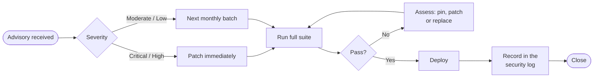
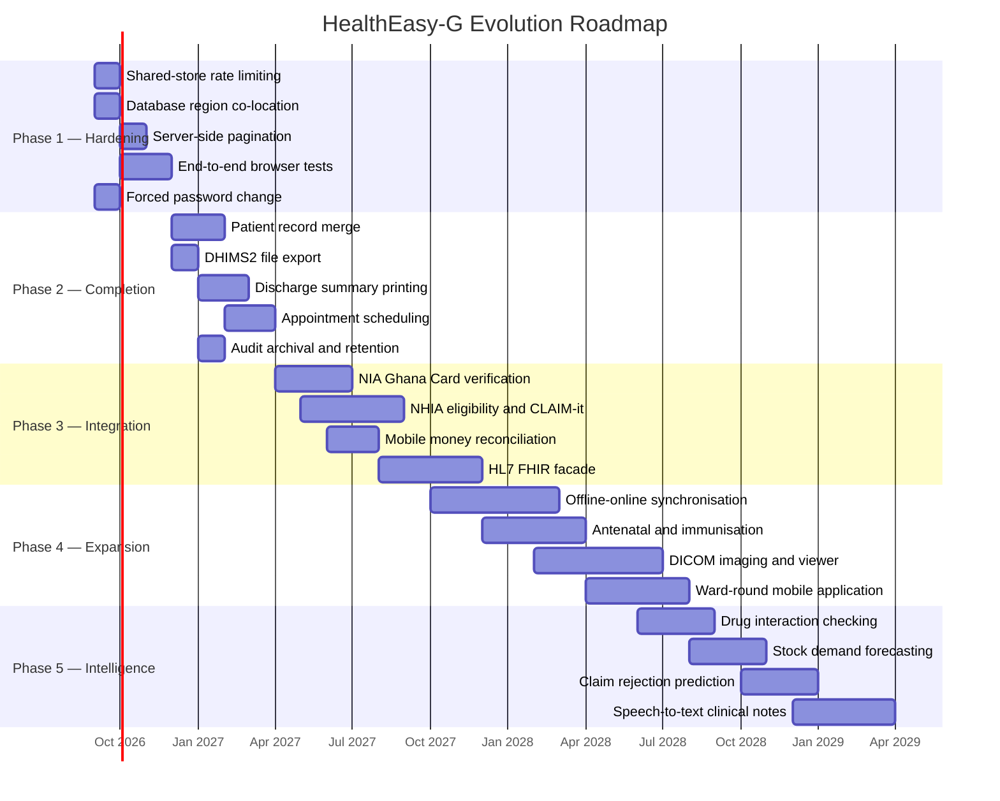

# Maintenance and Future Evolution Plan

**Project:** HealthEasy — HealthEasy-G Hospital Management System
**Group:** Architects
**Course:** CSCD602 Advance Software Development, University of Ghana
**Document version:** 1.0

---

# 1. Introduction

Software that manages a hospital is never finished. Tariffs change, regulations change,
dependencies acquire vulnerabilities, and staff ask for things nobody anticipated. This
document sets out how HealthEasy-G is maintained after deployment and how it can evolve
without being rewritten.

It is organised around Lientz and Swanson's four categories of software maintenance —
corrective, adaptive, perfective and preventive — because they map cleanly onto the kinds of
change a hospital system actually receives.

## 1.1 What Makes This System Maintainable

Three architectural decisions carry most of the maintenance burden, and they are worth
stating before the process detail, because process cannot compensate for a design that
resists change.

**Invariants live in one place.** The access policy is one file. Storage-to-presentation
conversion is one file. Date handling is one file. When a rule changes, there is one place to
change it and one place to review. A rule scattered across twenty-four handlers cannot be
maintained at all — only patched repeatedly.

**The type system carries the schema.** Prisma generates types from the database schema, and
TypeScript is configured strictly. A column rename does not become a runtime surprise; it
becomes a compile error at every site that used it, before anything is deployed.

**Tests assert properties, not just behaviours.** One test asserts that every permission the
access policy references is held by at least one role. That test found a defect no manual
plan would have looked for. Properties of this kind keep their value as the system grows.

---

# 2. Corrective Maintenance

Correcting defects found after release.

## 2.1 Defect Classification

| Severity | Definition | Response | Fix target |
| :--- | :--- | :--- | :--- |
| **Critical** | Patient safety at risk, data loss, security breach, or system unusable | Immediate | 24 hours |
| **High** | A requirement is not met; no workaround | Same working day | 3 working days |
| **Medium** | Incorrect behaviour with a workaround | Next working day | 2 weeks |
| **Low** | Cosmetic or minor inconvenience | Triaged into the backlog | Next scheduled release |

Severity is judged by clinical consequence, not by technical difficulty. A misspelled label is
Low; a dose recorded against the wrong patient is Critical regardless of how small the fix is.

## 2.2 Bug-Fixing Process

```mermaid
flowchart LR
    A([Defect reported]) --> B[Record: what was expected,<br/>what happened, role, time]
    B --> C{Reproducible?}
    C -->|No| D[Gather audit-trail<br/>evidence for the stated time]
    D --> C
    C -->|Yes| E[Assign severity]
    E --> F[Write a failing test<br/>that reproduces it]
    F --> G[Fix until the test passes]
    G --> H[Full suite + typecheck + build]
    H --> I{All green?}
    I -->|No| G
    I -->|Yes| J[Review against<br/>the security model]
    J --> K[Merge to main]
    K --> L[CI runs on a real database]
    L --> M[Deploy]
    M --> N[Confirm with the reporter]
    N --> O([Close, test retained<br/>as a regression guard])
```



**The failing test comes first.** This is not ceremony. A defect without a test is a defect
that returns, and in this project six of the seventeen defects found during development were
of a kind that would have returned silently — a swallowed write, a permission held by nobody,
a date compared as text.

## 2.3 Diagnostic Assets

| Asset | What it answers |
| :--- | :--- |
| Audit trail | Who did what, to which patient, when, from where |
| Explanatory error messages | What the system refused and why |
| `scripts/db-inspect.mjs` | Whether the data is what the reporter thinks it is |
| Typed errors (`ApiError`) | Whether a failure was authorisation, validation or infrastructure |
| Vercel logs | Server-side stack traces |

Because every failed write surfaces a message naming the action and the reason, most reports
arrive already carrying their own diagnosis.

---

# 3. Adaptive Maintenance

Adapting to changes in the environment the system operates in. For a Ghanaian hospital system
this is the most frequent category, because the regulatory environment moves independently of
the software.

## 3.1 Anticipated External Changes

| Change | Frequency | Impact | Preparation already made |
| :--- | :--- | :--- | :--- |
| NHIA G-DRG tariff revision | Annual | Claim amounts | Tariffs are data, not code — a tariff table update, no deployment |
| ICD-10 code set update | Periodic | Diagnosis coding | Codes are data |
| DHIMS2 return format change | Occasional | Statutory reporting | Figures are computed from clinical data, so a format change affects presentation only |
| HeFRA licensing requirements | Occasional | Facility records | Facility fields are additive |
| Data Protection Act guidance | Occasional | Access policy, retention | Policy is declared in one file; retention is configurable |
| Node.js LTS transition | Annual | Runtime | Standard library only; no runtime-specific code |
| PostgreSQL major version | ~Annual | Database | Standard SQL and Prisma; no version-specific features |
| Browser releases | Continuous | Interface | Standard APIs; no vendor prefixes |

## 3.2 Adapting to a New Facility Type

The system was built for a regional hospital. Adapting it to a polyclinic or a CHPS compound
requires configuration rather than code: facility type and bed capacity are fields, roles are
assigned per account, and modules appear according to role. A facility with no laboratory
simply has no staff holding laboratory permissions.

## 3.3 Adapting to Multi-Facility Operation

Multi-facility support already exists: `FacilityBranch` records, a `facilityId` on patients
and staff, and a facility selector in the interface. Extending to a district or regional
grouping means adding a parent relationship on the facility record and aggregating statistics
across children — an additive change.

---

# 4. Perfective Maintenance

Improving the system in response to use, without changing what it is for.

## 4.1 Improvements Identified

| Improvement | Origin | Effort |
| :--- | :--- | :--- |
| Patient record merge | Deferred requirement FR-PAT-07 | Medium |
| Offline-to-online synchronisation | Facilities working offline need their records centrally | Large |
| DHIMS2 file export | Figures are computed but must be re-keyed into DHIMS2 | Small |
| Bulk laboratory result entry | Technicians enter results one parameter at a time | Small |
| Configurable triage thresholds | Currently constants in code | Small |
| Saved report views | Directors repeat the same filters | Small |
| Printable discharge summary | Currently on-screen only | Medium |
| Appointment scheduling | Queues are same-day only | Medium |

## 4.2 How Improvements Are Prioritised

Weighted by clinical value, frequency of use, effort and risk. Anything touching the access
model or a transaction boundary carries an automatic risk weighting, because those are the
places where a well-intentioned change can quietly remove a safeguard.

---

# 5. Preventive Maintenance

Work done to stop defects arising, rather than to fix them.

## 5.1 Standing Practices

| Practice | Cadence | Purpose |
| :--- | :--- | :--- |
| Dependency audit (`npm audit`) | Weekly, automated | Detect published vulnerabilities |
| Dependency updates | Monthly | Avoid large, risky version jumps |
| Restore rehearsal | Quarterly | Prove backups are actually restorable |
| Session secret rotation | Quarterly | Limit the value of a leaked secret |
| Access policy review | Quarterly | Confirm the policy still matches practice |
| Audit trail review | Weekly | Detect unusual access patterns |
| Index review | Semi-annual | Keep queries efficient as tables grow |
| Dead code removal | Ongoing | Unused code is unreviewed code |

## 5.2 Technical Debt Register

Recorded openly, because undocumented debt is the kind that is repaid at the worst moment.

| Item | Consequence | Planned remedy |
| :--- | :--- | :--- |
| Rate limiting is process-local | On multiple instances each counts separately, weakening throttling | Move counters to Redis |
| Demonstration accounts share a password | Acceptable for a seeded demonstration, unacceptable in production | Force a change on first sign-in |
| No end-to-end browser test suite | Interface regressions rely on manual checking | Add Playwright journey tests |
| Two collection reads exceed the latency target | Slower than intended, though usable | Co-locate database and application regions; add pooling |
| Theme template contains unused pages | Confusing to a new maintainer | Remove the unused theme demonstration pages |
| No archival of audit entries | The table grows without bound | Scheduled archive to cold storage with retention policy |

---

# 6. Version Control and Release

## 6.1 Repository

<https://github.com/NketiaAsubontengErnest/HealthEasy-G>

## 6.2 Branching

```
main                    ← always deployable; protected
 ├── feature/…          ← new capability
 ├── fix/…              ← defect correction
 └── chore/…            ← dependencies, tooling, documentation
```

Work happens on a branch and reaches `main` through a pull request. `main` is deployed
automatically.

## 6.3 Commit Conventions

Commits state what changed and why, in the imperative. The *why* matters more than the *what*
— a diff already shows what changed; only the message can record the reasoning that will be
needed a year later when someone asks whether a constraint is still required.

## 6.4 Continuous Integration

Every push and pull request runs, against a real PostgreSQL service container:

1. `npm ci`
2. `prisma db push` — schema applies cleanly
3. `tsx prisma/seed.ts` — seed runs
4. `npm run typecheck`
5. `npm test`
6. `npm run build`

A failure at any step blocks the merge.

## 6.5 Database Migrations

Schema changes are versioned SQL under `prisma/migrations/`, applied in order and never
edited once released. Migrations convert existing data in place rather than dropping columns —
the date migration in this release used explicit `USING` casts precisely so that no production
row would be lost.

## 6.6 Release Process

1. Merge to `main`.
2. CI verifies.
3. Vercel deploys automatically.
4. Migrations applied to the production database.
5. Smoke test the deployed instance: sign in, read a collection, confirm role separation.
6. Tag the release.

**Rollback:** Vercel retains previous deployments and can promote one immediately. A migration
that must be reversed requires a compensating migration, since forward-only migrations cannot
be undone by redeploying older code.

---

# 7. Dependency and Security Updates

## 7.1 Dependency Policy

| Class | Approach |
| :--- | :--- |
| Security patches | Applied immediately; High and Critical the same day |
| Patch releases | Monthly, batched |
| Minor releases | Monthly, after the test suite passes |
| Major releases | Evaluated individually; changelog reviewed; done on a branch |
| New dependencies | Justified against writing it directly — this project has repeatedly chosen the standard library over a package |

The dependency count is deliberately restrained. The test runner is the one built into
Node.js; session signing uses Web Crypto rather than a JWT library; validation is a
thirty-line file rather than a schema framework. Every dependency not taken is a supply-chain
risk not taken and an upgrade not owed.

## 7.2 Security Update Process



## 7.3 Standing Security Obligations

| Obligation | Frequency |
| :--- | :--- |
| `npm audit` | Weekly, automated |
| Session secret rotation | Quarterly |
| Access policy review against practice | Quarterly |
| Audit trail review for anomalies | Weekly |
| Dormant account review | Monthly |
| Penetration test | Annually, before any production use |
| Confirm `.env` remains untracked | Every release |

---

# 8. Scalability

## 8.1 Current Capacity

The deployed system serves a single regional hospital: roughly 50 concurrent staff, a few
hundred outpatient attendances a day, and low tens of thousands of records a year. Present
response times are between 0.6 s and 1.1 s warm.

## 8.2 Where It Would Strain First

| Limit | Symptom | Remedy |
| :--- | :--- | :--- |
| Serverless connection setup | Latency on the first request after idle | Connection pooling (PgBouncer or Prisma Accelerate) |
| Cross-region database round trip | Consistent ~1 s on collection reads | Co-locate database and application regions |
| Unbounded collection reads | Slow pages once tables reach tens of thousands of rows | Server-side pagination and filtering |
| Audit table growth | Slow audit queries | Partition by month; archive older partitions |
| Process-local rate limiting | Weak throttling across instances | Shared Redis counter |
| Client holds whole collections | Browser memory pressure | Fetch per screen rather than per session |

## 8.3 Scaling Path

**Vertical first.** Increase the database instance and add pooling. Simple, and sufficient for
several times the current load.

**Then read replicas.** Reporting and dashboards read from a replica, leaving the primary for
transactional work.

**Then partitioning.** Audit and clinical history partitioned by period.

**Only then, service extraction.** If one area genuinely outgrows the rest — most likely
reporting — extract it. This is deliberately last: splitting a system whose transactions span
its parts (dispensing and stock, batching and claim stamping) trades a clear atomicity
guarantee for a distributed transaction problem, and should only be paid for when the
alternative is worse.

---

# 9. Future Features

| Feature | Value | Effort | Depends on |
| :--- | :--- | :--- | :--- |
| Patient record merge | Completes duplicate handling | Medium | — |
| Offline-to-online synchronisation | Facilities with poor connectivity | Large | Conflict resolution design |
| DHIMS2 file export | Removes re-keying into DHIMS2 | Small | Format specification |
| Appointment scheduling | Reduces crowding | Medium | — |
| Discharge summary printing | Continuity of care | Medium | — |
| Antenatal and immunisation modules | Major GHS programmes | Large | Programme requirements |
| Theatre scheduling | Currently preparation only | Medium | — |
| Blood bank | Common regional hospital need | Large | — |
| Patient portal | Results and appointments | Large | Patient identity assurance |
| SMS notifications | Appointment and result alerts | Small | Gateway agreement |
| Mobile application for ward rounds | Bedside data entry | Large | API already suitable |

---

# 10. Technology Migration

## 10.1 What Would Trigger a Migration

Migration is a cost, not a virtue. It is justified when the current technology stops being
supported, stops meeting a requirement, or when the cost of remaining exceeds the cost of
moving.

| Component | Migration risk | Assessment |
| :--- | :--- | :--- |
| Next.js | Low | Actively developed; App Router is the current direction |
| PostgreSQL | Very low | Mature; no realistic reason to leave |
| Prisma | Low–medium | If it were abandoned, the data-access layer is confined to route handlers and one client module |
| Vercel | Low | The application is a standard Node.js server; any Node host can run it |
| Tailwind | Low | Styling is presentational; replaceable without touching logic |
| Ollama | Medium | Deliberately optional — the rule-engine fallback means its loss degrades rather than breaks the system |

## 10.2 What Makes Migration Feasible

The system depends on its own abstractions more than on its libraries. Session signing uses
Web Crypto, available in every modern runtime. Validation is our own code. The test runner is
Node's. Database access is confined behind Prisma, and Prisma behind route handlers. Nothing
in the domain logic knows what framework renders it.

---

# 11. Integration with Other Systems

| System | Purpose | Status | Requires |
| :--- | :--- | :--- | :--- |
| **NIA Ghana Card** | Verify identity at registration | Format validation only | Accredited integration agreement |
| **NHIA verification** | Confirm membership and eligibility live | Not integrated | NHIA API access |
| **NHIA CLAIM-it** | Submit claim batches directly | Batches prepared; submission manual | CLAIM-it interface specification |
| **DHIMS2** | Upload monthly returns | Figures computed; upload manual | DHIMS2 file format |
| **Mobile money (MTN, Telecel)** | Reconcile payments automatically | Recorded manually | Merchant API agreement |
| **PACS / DICOM** | Store and view images | Metadata only | DICOM server and storage |
| **Laboratory analysers** | Read results directly from instruments | Manual entry | HL7 or instrument interface |
| **Regional / national HIE** | Share records between facilities | Not integrated | FHIR profile and governance |

**Why these are not yet built.** Each of the first three requires a formal agreement with a
national body that is not available to a student project — a constraint recorded in the SRS
(C-03) rather than a gap in the design. The system is structured so that adding them is
additive: registration already validates a Ghana Card number, so a live check is an extra step
in an existing flow, not a new one.

**The strategic direction is HL7 FHIR.** It is the interoperability standard the Ghana Health
Service is moving toward, and the domain model maps onto it closely: Patient, Encounter,
Observation, DiagnosticReport, MedicationDispense and Claim all have direct FHIR equivalents.
Exposing a FHIR façade over the existing data would not require restructuring it.

---

# 12. AI and Emerging Technology

## 12.1 What Exists Now

A clinical decision-support assistant proposes prescriptions from the patient's diagnoses,
observations, allergies, chronic conditions, recent results and history. Three design
decisions govern it, and they should survive any future expansion:

1. **It can only suggest what the pharmacy holds.** Suggestions are filtered against live
   stock, so a hallucinated medicine cannot reach a prescribing screen.
2. **Allergy conflicts are re-derived by the system,** not accepted from the model. A patient
   safety control must not depend on a model's self-report.
3. **It degrades rather than fails.** With no model reachable, a deterministic Ghana Standard
   Treatment Guidelines rule engine answers instead, and the response says which produced it.

## 12.2 Candidate Extensions

| Extension | Value | Principal risk |
| :--- | :--- | :--- |
| Triage acuity suggestion | Consistency across nurses | Over-reliance; must remain advisory |
| Drug interaction checking | Safety | Requires a maintained interaction database |
| Discharge summary drafting | Clinician time | Fabrication; requires clinician confirmation |
| Demand forecasting for stock | Fewer stock-outs | Poor forecasts causing over-ordering |
| Attendance forecasting | Staffing | Seasonal variation |
| Claim rejection prediction | Revenue | Training data from actual rejections |
| Speech-to-text clinical notes | Faster consultation | Accuracy in accented English; privacy |
| Imaging triage support | Prioritising urgent studies | Regulatory approval required |

## 12.3 Principles for Any Future AI Feature

These follow from the assistant already built, and are stated so that a future maintainer does
not have to rediscover them:

- **Advisory, never autonomous.** No model output becomes a clinical action without a
  clinician's decision.
- **Grounded in facility data.** A suggestion referring to something the facility does not
  have is worse than no suggestion.
- **Safety checks performed independently.** Never delegate a safety control to the model
  producing the output.
- **Always a deterministic fallback.** A feature that stops working when connectivity fails is
  not usable in the intended environment.
- **The source is disclosed.** Users must know whether they are reading a model's output or a
  rule engine's.
- **Patient data stays under facility control.** A local model host, not a third-party API.

---

# 13. Future Evolution Roadmap



## 13.1 Phase Rationale

| Phase | Theme | Why in this order |
| :--- | :--- | :--- |
| **1 — Hardening** (Sep–Dec 2026) | Close the known technical debt | Everything else is built on this foundation; the open performance defect and the process-local rate limiter should not be carried forward |
| **2 — Completion** (Dec 2026–Mar 2027) | Finish deferred requirements | These complete what is already designed, and require no external agreement |
| **3 — Integration** (Apr–Dec 2027) | Connect to national systems | Highest operational value, but gated on agreements outside the team's control, so it cannot be scheduled earlier with confidence |
| **4 — Expansion** (Oct 2027–Aug 2028) | New clinical domains | Larger modules that assume a stable, integrated core |
| **5 — Intelligence** (Jun–Dec 2028) | AI beyond prescribing support | Requires accumulated operational data; forecasting without history is guesswork |

## 13.2 Success Measures

| Measure | Now | Target |
| :--- | :--- | :--- |
| Duplicate patient records | Prevented at registration | Zero, with merge available for historical duplicates |
| Collection read latency (95th percentile) | ~1.1 s | < 400 ms |
| NHIS claim rejection rate | Flags raised before submission | < 5% rejected |
| Time from result verified to clinician view | Immediate | Unchanged |
| Statutory returns requiring re-keying | All | None |
| Stock-outs of essential medicines | Reorder level flagged | Reduced by forecasting |
| Automated test coverage of Must requirements | All exercised | Maintained, with browser journeys added |

---

# 14. Maintenance Responsibilities

| Role | Responsibility |
| :--- | :--- |
| System administrator | Backups, restores, accounts, secret rotation, dependency updates, deployment |
| Development team | Defect correction, adaptive changes, feature work, tests, review |
| Hospital administration | Prioritisation, acceptance, regulatory change notification |
| System auditor | Audit trail review, access policy review, compliance |
| Data protection officer | Retention policy, subject access requests, breach response |

---

# 15. Conclusion

HealthEasy-G is maintainable primarily because of decisions taken during design rather than
processes imposed afterwards: invariants declared in one place, a type system that carries the
database schema into the code, and tests that assert properties rather than only behaviours.

The roadmap sequences hardening before completion, completion before integration, and
integration before expansion — because each phase depends on the stability of the one before,
and because the highest-value work (national system integration) is also the work most
dependent on external agreements. Building the intelligence phase first would produce a system
that forecast well and could not be trusted.

The known technical debt is recorded openly in §5.2, and the one open defect from testing is
scheduled in Phase 1. Nothing has been left undocumented in the hope that it will not be
noticed.

---

**End of Maintenance and Future Evolution Plan**
